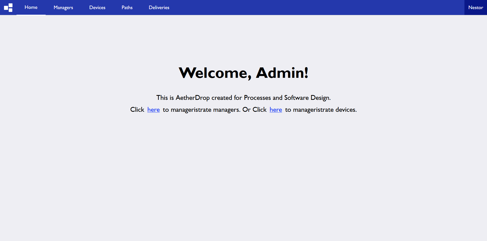
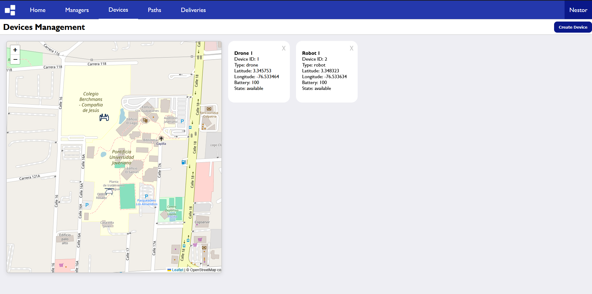
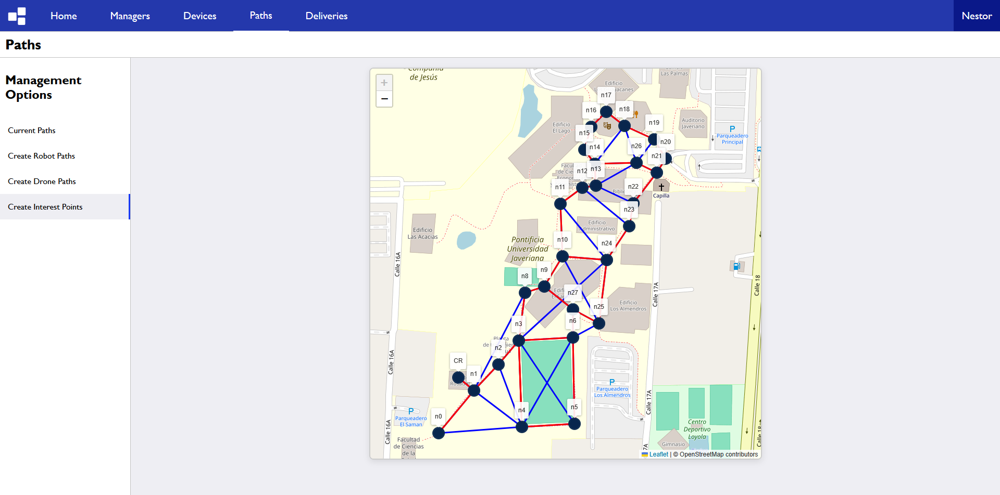
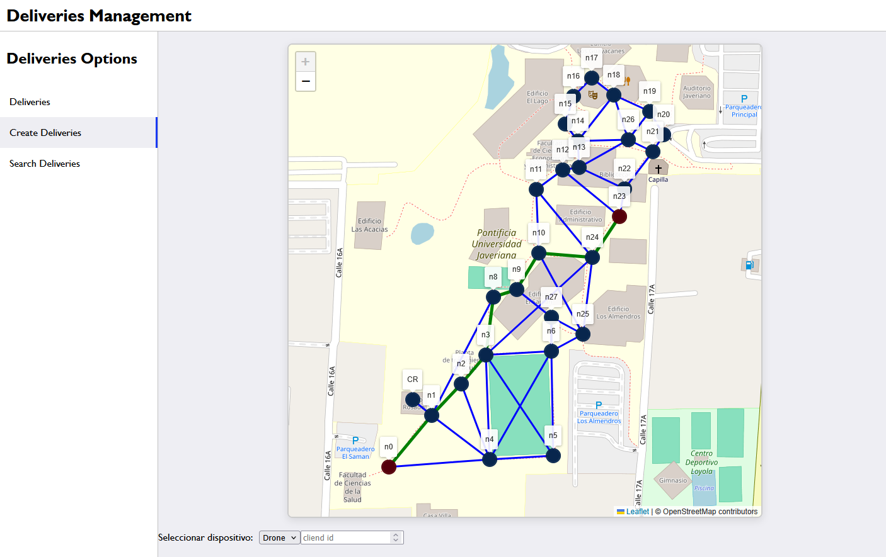

# AetherDrop

AetherDrop is a package delivery system within a university that allows a system manager to create delivery requests between a sender and a receiver, and monitor the status of the delivery in real time. The idea is that the devices responsible for delivering the packages are drones and robots.

## Real-Time Device Tracking
The graphical interface allows us to precisely see the location of each device.

## Route Definition
The administrator can define where the devices are allowed to move.

## Delivery Requests
Managers can create delivery requests between point A and point B within the defined routes.

## And More...
The system is still under development, and more features will be added in the near future.

